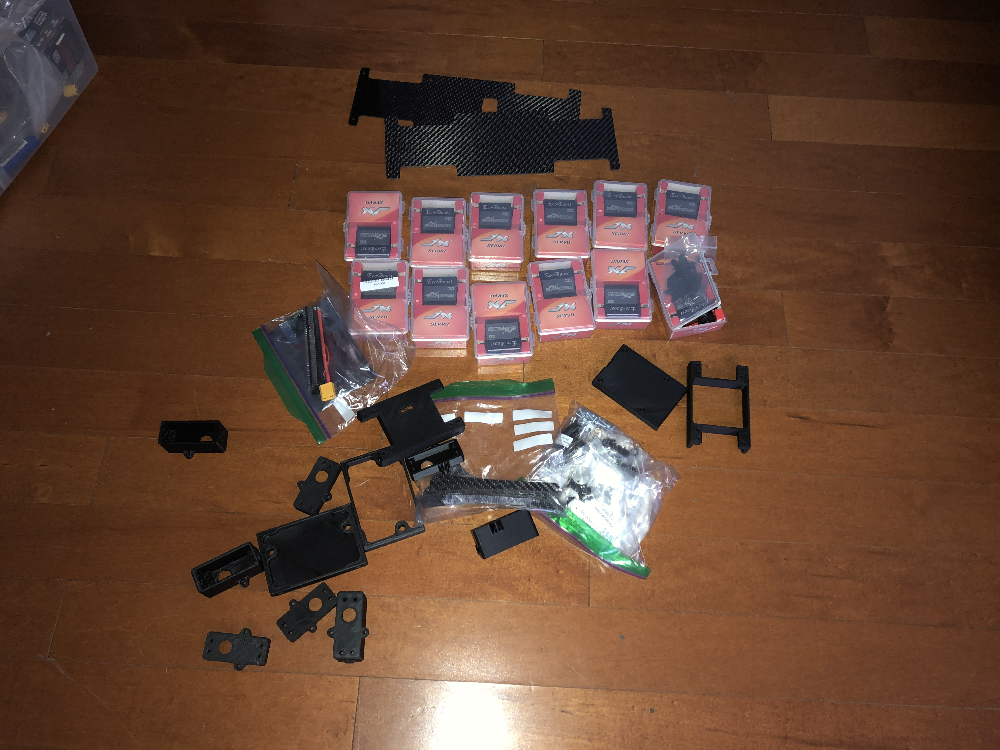

# Part Source

The parts can be categorized into "Hardware", "Electronics" and "Tools".

I followed most of the design from [Standord Pupper Bill Of Materials](https://docs.google.com/spreadsheets/d/1zZ2e00XdzA7zwb35Ly_HdzfDJcsxMIR_5vjwnf-KW70/edit#gid=226982759).

Some modifications:

- The 3D printed parts are printed by PETG instead of PLA to make the parts stronger.
- Intel Realsense camera is used for visual functions
- Nvidia Jetson Nano is used to extend the usability.